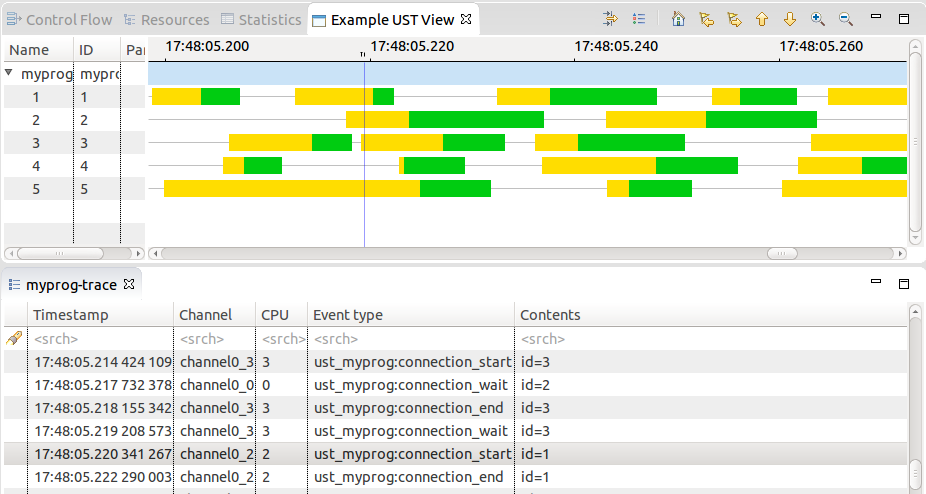

LTTng-UST + Trace Compass example
=================================

This repo contains a mini-tutorial of sorts that shows how to:
* Instrument a C application using [LTTng](http://lttng.org/) userspace tracepoints.
* Define a custom XML analysis in [Trace Compass](http://eclipse.org/tracecompass).
* Demonstrate how these tools used together can hopefully help you debug your own applications.

In this example, we have small custom C application that goes through different
internal states. The XML-defined analysis creates a view for Trace Compass that
will display these states graphically as a time graph.

Preparation
-----------

To go through this tutorial, you will need:
* lttng-tools and the lttng-ust libraries. See the [LTTng download page](http://lttng.org/download/).
  You will need the development files too, so if you install from distribution
  packages, do not forget to install the "liblttng-ust-dev" package or equivalent.
* A recent version of [Trace Compass](http://projects.eclipse.org/projects/tools.tracecompass/downloads).
  You will need a Java JRE, at least version 7.
* A local clone of this repository

Step 1: The C program with tracepoints
--------------------------------------

In the `program/` sub-directory, you will find a small C application `myprog.c`.
If you look at the code, you will see it simulates different blocks of work by
doing active waiting for random amount of time. Between each "block", we have a
tracepoint that indicates the state this particular thread is in. In the example
here we suppose the application is doing database or network connections, so it
goes through the states:

    idle -> attemping connection -> connection is established -> idle -> ...

This cycle is done many times, by many threads in parallel (implemented using
OpenMP). The variable `nb_threads` defines the number of concurrent threads, and
the variable `nb_loops` defines the number of loops each thread will go through.

So the application itself does exactly nothing, but the goal is to obtain
tracepoints separated by a random amount of time.

The `ust_myprog.h` file contains the tracepoint definition. Refer to the LTTng
documentation for more information. In standard UST fashion, we have put the
\#include directive in a separate `tp.c` file. This is normally so that the
tracepoints can be compiled in their own object, or even their own shared
library, although in this example we will put everything into the program
binary.

You can now use the provided Makefile to compile the program:

    $ make

You should now have a compiled `myprog` binary in the directory. Now to make
sure the tracepoints (and the tracer!) are working correctly, we can take a
trace of the execution of this program:

    $ lttng create
    $ lttng enable-event -u -a   # Enable all LTTng userspace events
    $ lttng start
    $ ./myprog
    $ lttng stop
    $ lttng destroy

Right before the `destroy` you can use `lttng view` (which will require the
`babeltrace` program to be installed) to display the contents of the trace. You
should get tracepoints representing the different states every thread goes in
(the 'id' field representing the thread number).

This is interesting, but ultimately not very useful: it is very hard to follow
one particular thread, or to have a look at the big picture just by looking at
the text dump. Enter the graphical view.

Step 2: The analysis in Trace Compass
-------------------------------------

For the next part, we will use the analysis defined in the file
`ust-example-analysis.xml`, in the `xml/` sub-directory. The syntax can be a bit
overwhelming at first, but should be straightforward enough to do basic
modifications, like changing the color of the displayed states or adding a new
state completely.

An "analysis" in Trace Compass is anything that does something with a trace. In
the example here, the analysis defines a state provider (which is a "recipe" to
populate the state database Trace Compass uses) and a custom time graph view.
They are represented by the `<stateProvider>` and `<timeGraphView>` blocks,
respectively. For more information on these, see the Trace Compass
documentation.

To load this analysis in Trace Compass, first start the program, then
right-click on the `Traces` folder in the Project Explorer view on the left, and
choose `Import XML analysis`. In the opened prompt you can navigate to and
select the `ust-example-analysis.xml` file. There is no UI yet to manage the
imported analyses, so if the dialog closes and there are no error popups, it
means the file was imported succesfully.

Then load the trace of the `myprog` program we took earlier. By default it
should be under `~/lttng-traces/`. You can right-click on `Traces` then choose
`Open Trace...` and select the `metadata` file of the LTTng trace you want to
open (or any of its files actually).

The trace should now be added to the list under "Traces". If you click on the
small triangle next to it, the subtree should display the list of available
analyses for this trace. In there, there should be the "UST Example Analysis"
that was imported with the XML file earlier. The sub-tree of the analysis itself
should show its outputs; the custom view defined in the file should be there.
If you double-click on the view's name, it will open the view in the current
perspective.

If you have done everything correctly, the view should display the states we
have defined for each of the thread in the application, the "connecting" states
in yellow and the "established" states in green:

Congratulations! You now know how to:
* Instrument an application with UST tracepoints
* Take a trace of such an application
* Define a custom Trace Compass analysis tailored to this application
* Open the resulting view in the graphical viewer

Additional exercises
--------------------

Some extra homework for the avid reader:

* In the `myprog.c` program, increase the number of threads (nb_threads) to a
  number far above the number of CPUs you have. Re-compile, re-trace, and open
  the new trace in Trace Compass (you should not have to re-import the XML
  analysis file if you do not modify it). Now if you look at the duration
  \- indicated in the tooltip \- of some of the states, there should be many that
  are higher than the expected maximum of 50 microseconds defined in the
  program. Can you explain why?

  * Hint: you can take a kernel trace at the same time as the program trace
    (add a `lttng enable-event -k -a` before `lttng start`), load it into Trace
    Compass into an experiment with the UST trace, and look at the Resource View.
    It should give some insight. (Well, it's quite obvious that "the CPUs are
    overloaded!!!1" but it's nice to get a graphical confirmation.)

* Add an additional state in the program, and display it in the view. This will
  require adding a new tracepoint definition in `ust_myprog.h`, adding a
  waitFor() and a tracepoint in the program, and adding the definition of this
  state in the XML file. Then re-compile, re-trace, re-import everything.

  * This can represent the case of adding a new tracepoint to an existing
    application, or simply to start tracking a tracepoint that was not used
    before.
